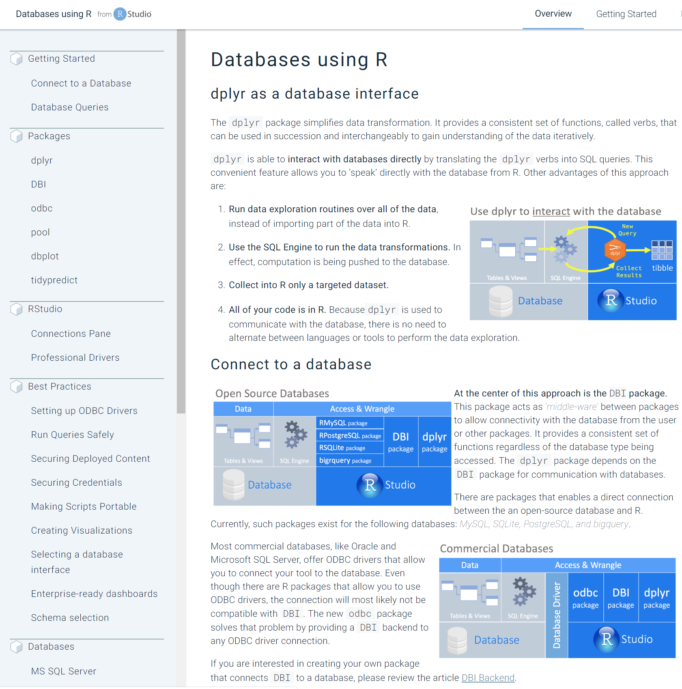
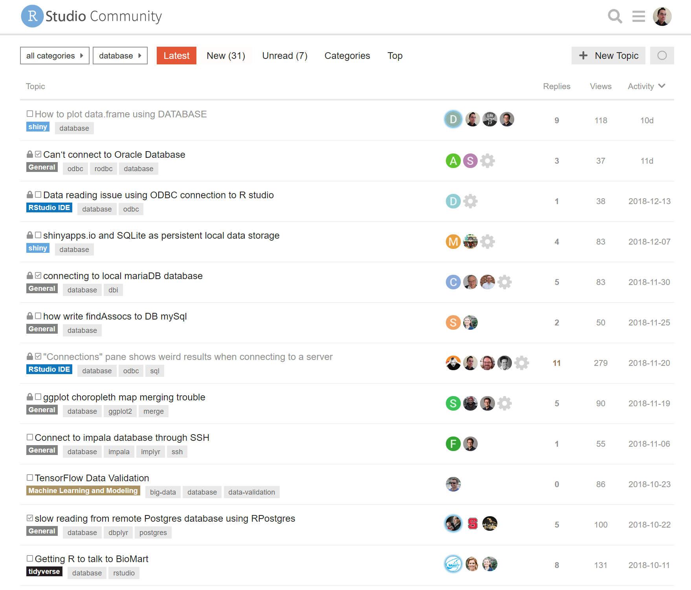
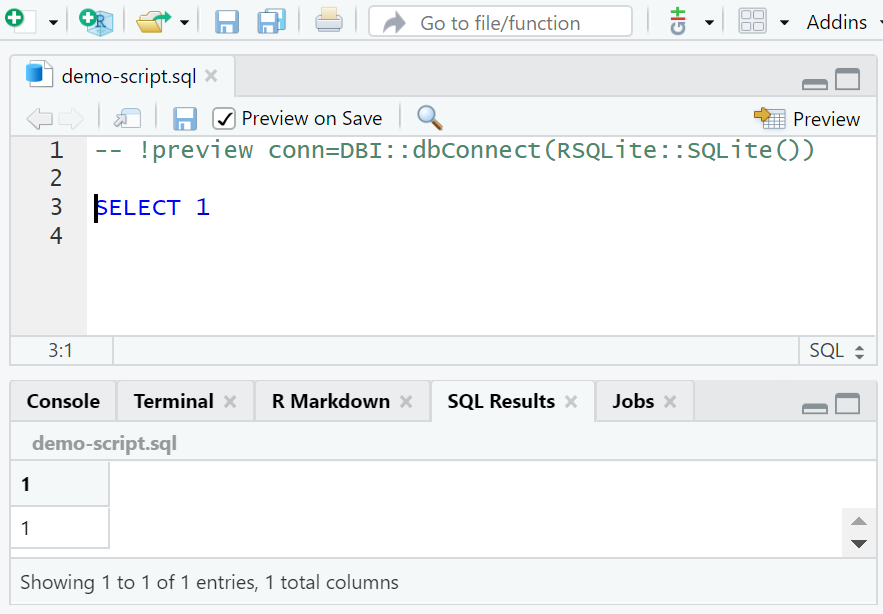
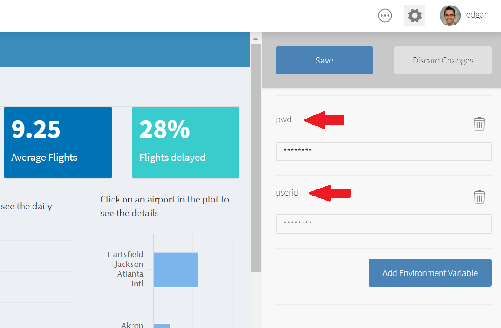
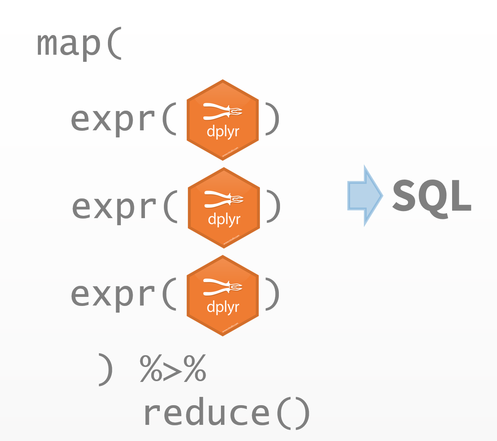

```{r setup, include=FALSE}
rmarkdown::output_metadata$set(rsc_output_files = list.files(recursive = TRUE, full.names = TRUE))
options(htmltools.dir.version = FALSE)

library(ggplot2)
library(tidyverse)
library(lubridate)
library(r2d3)

thm <- theme_bw() + 
  theme(
    panel.background = element_rect(fill = "transparent", colour = NA), 
    plot.background = element_rect(fill = "transparent", colour = NA),
    legend.background = element_rect(fill = "transparent", colour = NA),
    legend.key = element_rect(fill = "transparent", colour = NA)
  )
theme_set(thm)

reverse <- readRDS("reverse.rds")

reverse <- reverse %>%
  filter(
    str_detect(description, "database") | str_detect(description, "quer")
    )

edges <- reverse %>%
  select(reverse, depends, suggests, imports) %>%
  unite(deps, c("imports", "depends", "suggests")) %>%
  separate_rows(deps) %>%
  filter(deps %in% c("DBI", "dbplyr", "odbc")) %>%
  rename(from = deps, to = reverse) 

nodes <- select(edges, id = from) %>%
  bind_rows(
    select(edges, id = to) 
  ) %>%
  group_by(id) %>%
  summarise() %>%
  ungroup() %>%
  mutate(label = id) %>%
  mutate(shape = case_when(
    id == "DBI" ~ "circle",
    id == "dbplyr" ~ "circle",
    id == "odbc"~ "circle",
    TRUE ~ "ellipse"
  )) %>%
  mutate(color = case_when(
    id == "DBI" ~ "#ff6600",
    id == "dbplyr" ~ "#ff9900",
    id == "odbc"~ "#cc6633",
    TRUE ~ "#ffffcc"
  )) 

last <- reverse %>%
  mutate(yr = year(published)) %>%
  group_by(yr) %>%
  tally() %>%
  ungroup() %>%
  mutate(
    label = as.character(yr),
    x = yr,
    y = n
  )

ratio <- last %>%
  mutate(ratio = y / sum(y)) %>%
  filter(yr >= 2017) %>%
  pull(ratio) %>%
  sum() %>%
  round(digits = 2) 
```

class: panel-narrow-slide, left

# db.rstudio.com
.pull-left[New best practices articles for:
  - Connections
  - Security
  - Visualizations & Shiny
  - Interacting with DBs
  ]
.pull-right[]

.footnote[https://db.rstudio.com/]

---
class: panel-narrow-slide, left

# community.rstudio.com

.pull-left[
  ## Ask a questions, answer questions too!
  ]
.pull-right[]

.footnote[https://community.rstudio.com/tags/database/l/latest]
---

class: panel-narrow-slide, left

# New! SQL scripts in RStudio

.pull-left[
  Starting in 1.2, SQL scripts can be run inside the RStudio IDE
  ]
.pull-right[]


---
class: panel-narrow-slide, left

# New! RStudio Connect

.pull-left[
  ##  RStudio Connect allows R Environment Variables to be saved at the application level. The variables are encrypted on-disk, and in-memory.
  ]
.pull-right[ 

]
---

class: panel-narrow-slide, left

# More advanced programming

.pull-left[
  Users are implementing solutions using purrr and rlang
  ]
.pull-right[]
---
# The database-verse is expanding!

`r nrow(nodes) - 3` packages are DB themed & depend on DBI and/or dbplyr

```{r, echo = FALSE, fig.width=14, fig.height=6}
library(visNetwork)
visNetwork(nodes, edges) %>%
  visLayout(randomSeed = 10) %>%
   visInteraction(navigationButtons = TRUE)
```

---
class: panel-narrow-slide, left

# `r ratio * 100`% have been updated since 2017

```{r, echo = FALSE, fig.width=14, fig.height=6}
last %>%
  r2d3("col_plot.js")
```

---
class: subtitle-slide, white, middle, center

# Demo


---
class: panel-narrow-slide, left

# What to look foward to

--
### - Improve existing translations

--
### - More base translations (e.g: Natezza)

--
### - Improve back end packages (SQLite, monetDB, BigQuery)

--
### - More R-like functionality (via dbplyr or other packages) 

---
class: blank-slide, blue, center, middle

# Thank you!
