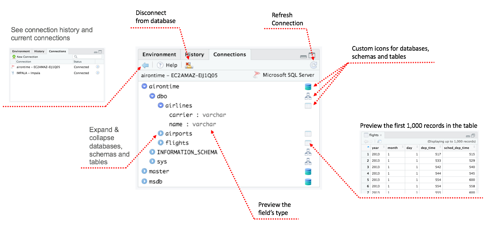
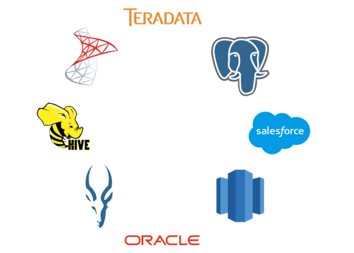

```{r setup, include=FALSE}
rmarkdown::output_metadata$set(rsc_output_files = list.files(recursive = TRUE, full.names = TRUE))
options(htmltools.dir.version = FALSE)

library(ggplot2)
library(tidyverse)
library(lubridate)
library(r2d3)

thm <- theme_bw() + 
  theme(
    panel.background = element_rect(fill = "transparent", colour = NA), 
    plot.background = element_rect(fill = "transparent", colour = NA),
    legend.background = element_rect(fill = "transparent", colour = NA),
    legend.key = element_rect(fill = "transparent", colour = NA)
  )
theme_set(thm)

reverse <- readRDS("reverse.rds")

reverse <- reverse %>%
  filter(
    str_detect(description, "database") | str_detect(description, "quer")
    )
```

class: subtitle-slide, blue, top, left
# Agenda

--

4 ways Databases+R is better today

--

Techniques to use in the field

--

The future

---

class: subtitle-slide, white, middle, center

# 4 ways Databases+R is better today

--
## 1. Packages

--
## 2. Getting help

--
## 3. Products

--
## 4. Tools


---

class: blank-slide, blue, center, middle

# Packages
### 4 ways Databases+R is better today

---

class: panel-narrow-slide, left

# Which packages?

### Quick search of CRAN packages that implement the database and R interface and is `DBI` compliant:

--
### - Packages the depend on `DBI`, `odbc` or `dbplyr`

--
### - In their title or description mentions the word "database" or "quer.." 

---

class: panel-narrow-slide, left

```{r, include = FALSE}
edges <- reverse %>%
  select(reverse, depends, suggests, imports) %>%
  unite(deps, c("imports", "depends", "suggests")) %>%
  separate_rows(deps) %>%
  filter(deps %in% c("DBI", "dbplyr", "odbc")) %>%
  rename(from = deps, to = reverse) 

nodes <- select(edges, id = from) %>%
  bind_rows(
    select(edges, id = to) 
  ) %>%
  group_by(id) %>%
  summarise() %>%
  ungroup() %>%
  mutate(label = id) %>%
  mutate(shape = case_when(
    id == "DBI" ~ "circle",
    id == "dbplyr" ~ "circle",
    id == "odbc"~ "circle",
    TRUE ~ "ellipse"
  )) %>%
  mutate(color = case_when(
    id == "DBI" ~ "#ff6600",
    id == "dbplyr" ~ "#ff9900",
    id == "odbc"~ "#cc6633",
    TRUE ~ "#ffffcc"
  )) 
```


# `r nrow(nodes) - 3` Dependent Packages

```{r, echo = FALSE, fig.width=14, fig.height=6}
library(visNetwork)
visNetwork(nodes, edges) %>%
  visLayout(randomSeed = 2) %>%
   visInteraction(navigationButtons = TRUE)
```

---
class: panel-narrow-slide, left

```{r, include = FALSE}
last <- reverse %>%
  mutate(yr = year(published)) %>%
  group_by(yr) %>%
  tally() %>%
  ungroup() %>%
  mutate(
    label = as.character(yr),
    x = yr,
    y = n
  )

ratio <- last %>%
  mutate(ratio = y / sum(y)) %>%
  filter(yr >= 2017) %>%
  pull(ratio) %>%
  sum() %>%
  round(digits = 2) 
```


# `r ratio * 100`% have been updated since 2017

```{r, echo = FALSE, fig.width=14, fig.height=6}
last %>%
  r2d3("col_plot.js")
```

---

class: panel-narrow-slide, left

# Features, fixes & improvements

.pull-left[
- `dbplyr`: supports `stringr` functions
- `dbplyr`: 145 commits since '18, 98 in '19
- `corrr`: supports databases
- `tidypredict`: supports MARS models
]
.pull-right[]
---

class: blank-slide, blue, center, middle

# Getting help
### 4 ways Databases+R is better today

---
class: panel-narrow-slide, left

# db.rstudio.com
.pull-left[Best practices for:
  - Connections
  - Security
  - Visualizations & Shiny
  - Interacting with DBs
  ]
.pull-right[]

.footnote[https://db.rstudio.com/]

---
class: panel-narrow-slide, left

# community.rstudio.com

.pull-left[
  ## Ask a question, get help from us and practicing experts.
  ]
.pull-right[]

.footnote[https://community.rstudio.com/tags/database/l/latest]
---

class: blank-slide, blue, center, middle

# Products
### 4 ways Databases+R is better today

---
class: panel-narrow-slide, left

# Explore databases in RStudio

.pull-left[Since 1.1, we can explore database object and even preview the first 1K records right from the IDE!
  ]
.pull-right[]

---
class: panel-narrow-slide, left

# RStudio Pro Drivers

.pull-left[## Implementing RStudio products on the Enterprise? We include Professional ODBC drivers with our Professional products.
  ]
.pull-right[]

---
class: panel-narrow-slide, left

# New! SQL scripts in RStudio

.pull-left[
  Starting in 1.2, SQL scripts can be run inside the RStudio IDE
  ]
.pull-right[]


---
class: panel-narrow-slide, left

# New! RStudio Connect

.pull-left[
  ## Starting with version 1.6, RStudio Connect allows R Environment Variables to be saved at the application level. The variables are encrypted on-disk, and in-memory.
  ]
.pull-right[ 

]
---

class: blank-slide, blue, center, middle

# Tools
### 4 ways Databases+R is better today

---
class: panel-narrow-slide, left

# `tidyveval` & recursion

.pull-left[
  Users are implementing solutions using `purrr` and `rlang`
  ]
.pull-right[]
---

class: subtitle-slide, white, middle, center

# Techniques to use in the field

--
## Demo

---

class: subtitle-slide, white, middle, center

# The future

---
class: panel-narrow-slide, left

# What to look foward to

--
### - Improve existing translations

--
### - More base translations (e.g: Natezza)

--
### - Improve back end packages (SQLite, monetDB, BigQuery)

--
### - More R-like functionality (via dbplyr or other packages) 

---
class: blank-slide, blue, center, middle

# Thank you!
